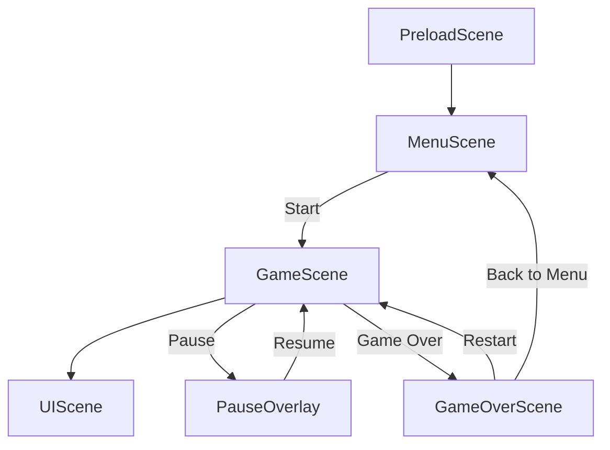
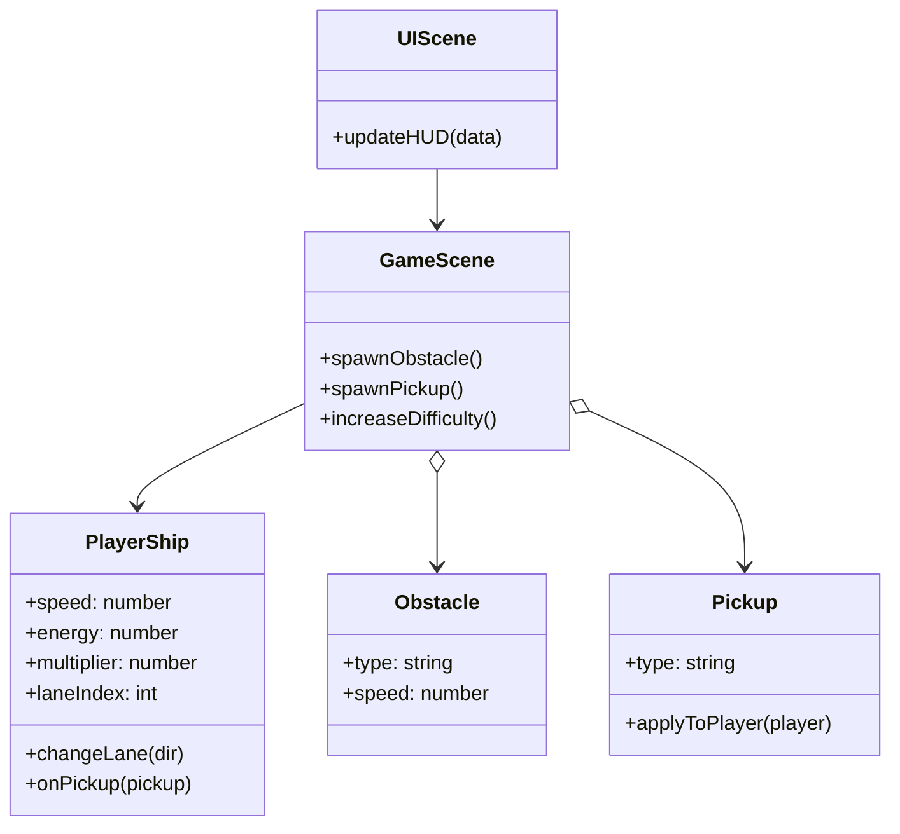

### Microlet Rush 2.0 — Space Runner Design Spec

#### High-level concept
- **Elevator pitch**: Endless space-lane runner. Pilot a microlet-turned-miniship through cosmic lanes, dodging planets, asteroids, and debris while collecting stars, fuel cells, and rescuing stranded astronauts.
- **Core loop**: Start → fly and swap space lanes → avoid hazards → collect pickups → score increases with distance and multipliers → energy drains → game over on collision or energy out → retry.
- **Target platform**: Desktop and mobile web using Phaser 3.60 (canvas renderer). Responsive inputs for keyboard and touch.

#### Space theme adjustments
- **Lanes**: Three “space currents.” Player snaps between lanes for clarity and mobile friendliness.
- **Player visual**: Use existing microlet sprites as ships; add glow, thruster particles, and subtle hover bob.
- **Obstacles**: Asteroids (small/medium), mini-planets, satellite debris; advanced: a fast comet traversing lanes, or a black-hole gravity well (optional later).
- **Pickups**: Stars (coins), fuel cells (fuel), astronauts (passengers/multiplier).
- **Background**: Parallax deep space with starfield particles and tinted nebula layers (repurpose existing background textures).

#### Scenes and flow
- **PreloadScene**: Load textures/audio; show progress bar.
- **MenuScene**: Title, best score, ship selection (microlet variants), start.
- **GameScene**: Core gameplay, parallax, spawners, collisions, difficulty ramp.
- **UIScene**: HUD overlay (score, fuel, stars, astronauts, pause).
- **PauseOverlay**: Dimmed layer with resume/menu.
- **GameOverScene**: Final score, stats, restart/menu.

#### Assets mapping (using existing `sprites/`)
- **Background layers** (tinted for space):
  - `sprites/background/sky.png` → far gradient base + starfield overlay.
  - `sprites/background/mountains.png` → far-mid nebula texture (deep tint, low alpha).
  - `sprites/background/buildings.png` → mid nebula/structures texture (tint, blur via scale).
  - `sprites/background/roadside.png` → near parallax haze/debris texture (dark tint).
  - `sprites/background/road.png` or `sprites/background/road.2.png.jpg` → near star streak layer (heavy tint, adjust scale).
- **Player ships**: `sprites/microlets/{esperansa,kuitadu,realize_dream,silver_omega}.png` with glow and thruster particles.
- **Obstacles**:
  - `sprites/obstacles/pothole.png` → small asteroid cluster (recolor/tint).
  - `sprites/obstacles/yellow_taxi.png` → satellite pod/mini-planet (tint/scale). Temporary until bespoke space art.
- **Pickups**:
  - `sprites/pickups/coin.png` → star collectible (gold/white tint + sparkle).
  - `sprites/pickups/fuel.png` → fuel cell (cyan/teal tint + pulse).
  - `sprites/pickups/passenger.png` → astronaut rescue icon (glow).

#### Gameplay
- **Lanes**: 3 lanes; ship snaps between lanes via short tween; predictable positions.
- **Controls**:
  - Desktop: Left/Right (A/D) to change lanes; P to pause.
  - Mobile: Swipe left/right to change lanes; tap top-right to pause.
- **Speed & difficulty**:
  - Base world scroll speed ramps gradually.
  - Spawn rates increase; comet-type obstacle may occasionally sweep across lanes.
- **Energy (fuel)**:
  - Drains at a fixed rate; fuel cell pickup restores energy. Low-energy warning (UI + audio + slight flicker).
- **Score**:
  - Distance-based score + stars collected.
  - Astronauts grant a temporary score multiplier (time-limited, stacks extend duration).
- **Collisions**:
  - Obstacle collision → explosion FX + screen shake → game over.
  - Pickups → SFX, tween pop, particle burst, and HUD update.
- **Persistence**:
  - Save `bestScore` and simple stats to `localStorage`.

#### Systems and components
- **ParallaxSpace**: Manages starfield particle emitters, tinted nebula tileSprites, and near-layer streaks.
- **LaneManager**: Maps lane index ↔ Y position; handles snap tweens and bounds.
- **Spawner**:
  - Obstacles: weighted selection (asteroid, mini-planet, debris, comet); enforce fair spacing and avoid unavoidable patterns.
  - Pickups: bias stars > fuel > astronauts; avoid overlap with obstacles.
- **DifficultyManager**: Curves for spawn cadence, world speed, and comet frequency.
- **Collision system**: Arcade physics overlap/collide for ship vs obstacles/pickups.
- **Audio**: Thruster hum (pitch by speed), pickup pings, proximity alert, lane-change whoosh, crash boom.
- **Events** (cross-scene): `score:update`, `fuel:update`, `stars:update`, `astronauts:update`, `game:pause`, `game:resume`, `game:over`.

#### Technical architecture (Phaser 3)
- **Config**:
  - Size: 768×432 (16:9), scale `FIT`, auto-center.
  - Physics: Arcade, gravity `0`, debug toggle via query param (e.g., `?debug=1`).
  - Scenes: `PreloadScene`, `MenuScene`, `GameScene` (+ parallel `UIScene`), `GameOverScene`.
- **GameScene**:
  - `create()`:
    - Build `ParallaxSpace` backgrounds and starfield.
    - Instantiate player ship at center lane; setup controls.
    - Launch `UIScene` and wire event emitter.
    - Initialize spawners and start difficulty timers.
  - `update(t, dt)`:
    - Scroll backgrounds by current world speed.
    - Handle input and lane-change tweening.
    - Move obstacles/pickups left; cull off-screen.
    - Check collisions; update energy and score; emit HUD events.
- **UIScene**:
  - HUD containers/icons for stars, fuel, astronauts; distance text; pause button.
  - Listens to game events to update values and play warnings.

#### Proposed file structure
- `index.html` (already includes Phaser 3.60)
- `js/config.js` — Phaser config and constants.
- `js/main.js` — creates `Phaser.Game`, registers scenes.
- `js/scenes/PreloadScene.js`
- `js/scenes/MenuScene.js`
- `js/scenes/GameScene.js`
- `js/scenes/UIScene.js`
- `js/scenes/GameOverScene.js`
- `js/systems/ParallaxSpace.js`
- `js/systems/LaneManager.js`
- `js/systems/Spawner.js`
- `js/systems/DifficultyManager.js`
- `js/entities/PlayerShip.js` (uses microlet sprite art)
- `js/entities/Obstacle.js`
- `js/entities/Pickup.js`
- `assets/` (future audio/fonts)

#### Data and constants (initial values)
- **Lanes Y**: computed from height with padding, e.g., `[h*0.58, h*0.70, h*0.82]`.
- **Speeds**: base `180 px/s`; ramp `+0.02 px/s` per second.
- **Spawns**:
  - Obstacles: every `1300–1800 ms`; min horizontal gap `220 px`; comet chance ramps.
  - Pickups: every `700–1100 ms`; avoid overlapping obstacles; lane alternation bias.
- **Energy**: max `100`; drain `4/s`; fuel cell `+25`.
- **Scoring**: `+1` per ~`10 px`; star `+10`; astronaut `+50` and `×1.5` multiplier for `10 s` (stack extends duration).

#### Visual/UI
- **HUD**: Top bar with icons (star, fuel cell, astronaut) and counts; large distance score.
- **Feedback**: Near-miss spark, comet trail particles, ship glow intensifies with multiplier; low-energy vignette.
- **Game over**: Show score, best, stars collected, astronauts rescued; restart/menu buttons.

#### Input & accessibility
- Lane-change tween `120–160 ms`; consistent, predictable arcs.
- Reduced motion mode: lower particle density and no screen shake.
- Mobile vibration (if available) on crash and pickups.

#### Telemetry (optional)
- Track runs, duration, top speed, stars, astronauts locally (no network).

#### MVP → Next steps
- **MVP**: `PreloadScene`, `GameScene`, `UIScene`; parallax space (starfield + tinted textures); 3 lanes; asteroids/planets; stars/fuel/astronaut pickups; collisions; game over with best score persistence.
- **Next**: `MenuScene` + ship selection, comet hazards with trails, black-hole pull zone, pause overlay, audio set, polish and juice.

